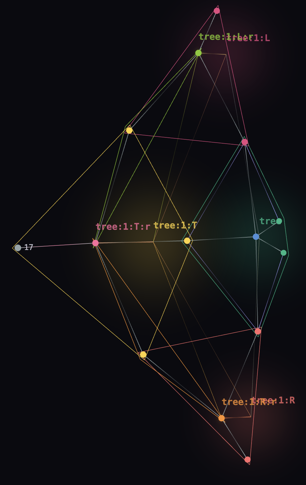
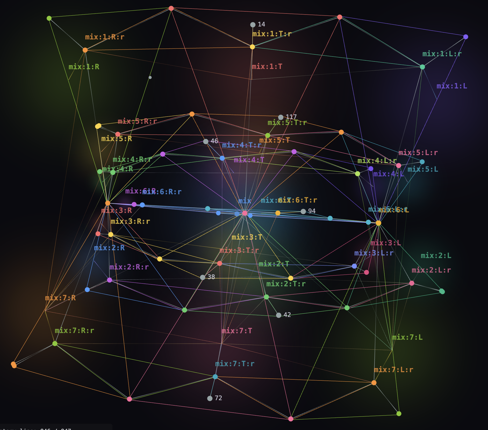
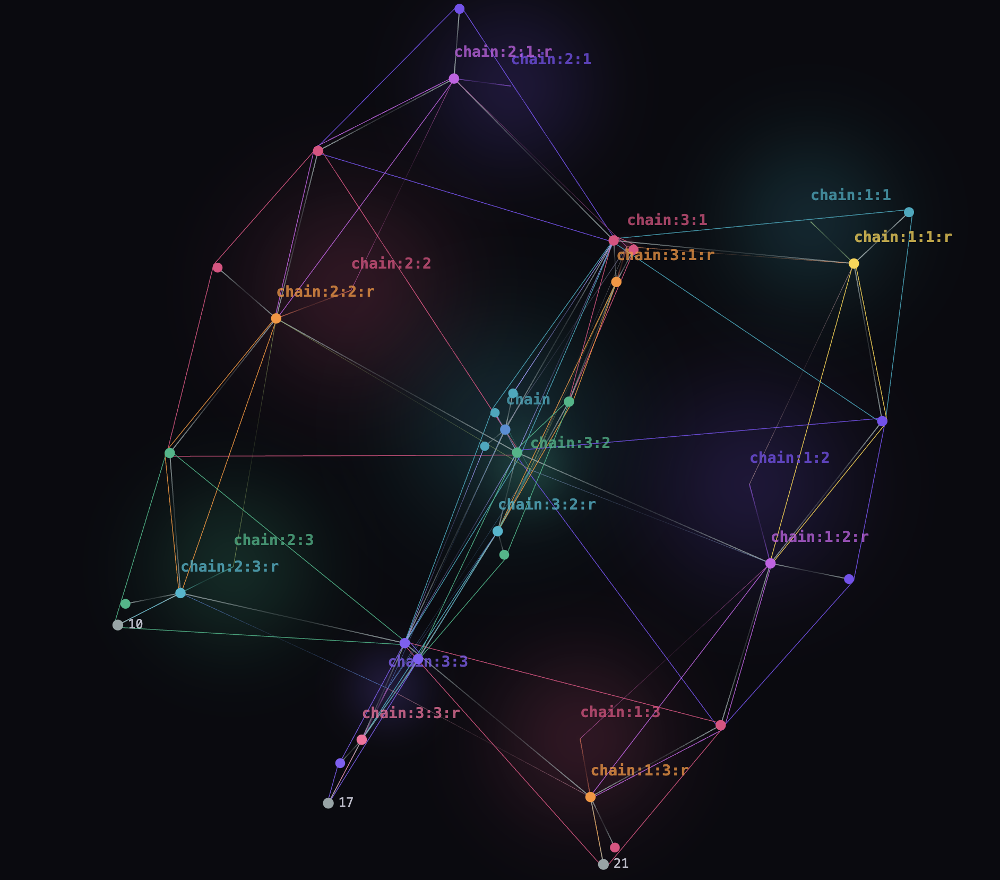

# tesseract

[ [videos](https://www.youtube.com/watch?v=YHTvPHo9dkE) ]

tesseract is a hypergraph visualization of runtime execution within its own OS, an inherently visual programming language. The hypergraph is itself all knowledge visualized using gradient descent and other heuristics.

User customizable heuristic most certainly possible in the form of tethers.

I'm explicitly separating the two efforts only because the runtime execution part from everything that has been developed alongside depgraph.

## Art Gallery

Point on screen to drive the tesseract. Finger press performs gradient descent and also pans towards that position. Zooming using 2 fingers performs zoom, duh.

In an art gallery, a solo person would have total control. In multi-people interactions, shared control is performed by applying all requests and averaging them out. This results in a VERY interesting social experiment, where will they go? Complete discoordination would most likely only lead to central navigation and fixed zooming as everyone is moving in all directions and zooming and unzooming at the same time. 

## Shapes

**tree: ((a+b)+(c+d))**

**mix: ((a*b)+(c*d))**

**chain: (((a+b)+c)+d)**
